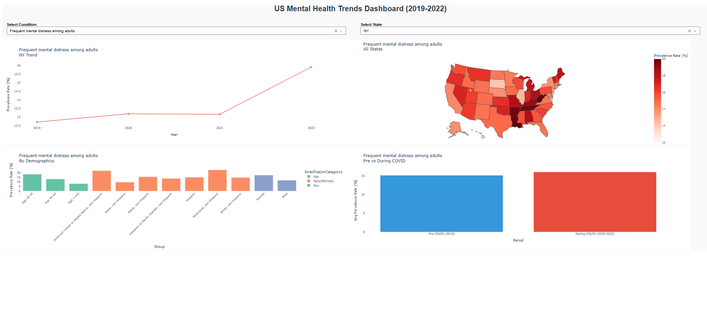

# 🧠 US Mental Health Trends Analysis (2019–2022)

## 📌 Overview

This project analyzes mental health trends across the United States using CDC data, focusing on the **impact of the COVID-19 pandemic (2019–2022)** on depression and mental distress across states and demographic groups.

---

## 🎯 Objective

* Identify high-risk states with elevated mental health issues
* Analyze disparities across age, gender, and race/ethnicity
* Compare mental health trends **before vs during COVID-19**
* Build an interactive dashboard for data exploration

---

## 🔍 Key Insights

* 📈 Mental health distress **increased significantly during COVID (2020–2022)**
* 🗺️ West Virginia, Tennessee, and Louisiana show consistently high prevalence
* 👩 Females report higher distress than males across all states
* 👥 Age group **18–44** is the most affected demographic
* 🌎 Multiracial and American Indian/Alaska Native groups show highest rates

---

## 🛠️ Tech Stack

* Python
* Pandas
* Matplotlib & Seaborn
* Plotly
* Dash

---

## 📂 Project Structure

```
mental-health-trends/
├── data/
├── notebooks/
├── dashboard/
├── visuals/
└── README.md
```

---

## ▶️ How to Run

```
pip install -r requirements.txt
cd dashboard
python app.py
```

Then open:
http://127.0.0.1:8050

---

## 📸 Dashboard Preview



---

## 🧠 Key Takeaway

This project demonstrates an **end-to-end data analytics pipeline**, from data cleaning and exploratory analysis to interactive dashboard development, applied to a real-world public health problem.
